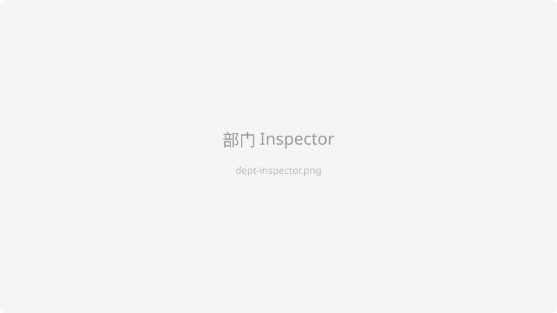
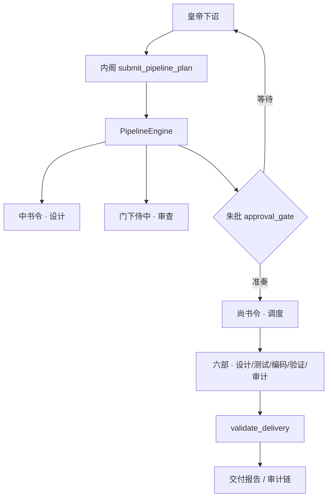

# 枢机 (ShuJi)

[](https://github.com/Fakerol-111/ShuJi/actions/workflows/check.yml)
[](LICENSE)


> 基于中国古代三省六部制的 AI 驱动自动化软件开发系统。每个部门是一个 LLM Agent，通过角色分工和文档化通信，模拟从需求分析到编码测试的完整软件工程流程。

**枢机**是一款 Rust + Tauri v2 桌面应用：你说出需求，内阁调度各部门协作完成设计、审查、编码与测试，全程可审计、可回滚。

与普通 Chat Coding 不同，枢机把**设计 / 审查 / 编码 / 测试**拆成独立 Agent，用 **`.shuji/` 文档**传递契约，在关键节点等你 **朱批** 后再继续——更像一条可治理的软件工程流水线，而不是单窗口无限对话。

---

## 界面一览

> 以下为线框占位图，真实截图放入 `assets/images/`（本地资源，不上库）。

| 工作台总览 | 部门 Inspector |
|:---:|:---:|
|  |  |

| 朱批文档 | 文移图 / Pipeline |
|:---:|:---:|
|  |  |

---

## 特性

- **多 Agent 协作** — 9 个部门 Agent + 2 个子 Agent，按任务复杂度自动选择工作流（demo / simple / standard / complex 等）
- **文档即契约** — 部门间通过 `.shuji/` 下的结构化文档通信，不靠对话上下文「口头传递」
- **朱批审批** — 方案与审查文档需你确认后，下游才能继续执行
- **Checkpoint 回滚** — 定时快照工作区与会话状态，可在 UI 中浏览并恢复
- **完整审计链** — 操作日志、文档血缘、变更 diff，关键步骤可追溯
- **灵活 API 配置** — 支持 Anthropic / OpenAI / DeepSeek 及兼容接口，可按部门独立配置厂商与模型
- **推理/思考展示** — 支持 per-vendor 推理链（reasoning/thinking tokens）展示，可查看 LLM 的推理过程

---

## 快速开始

### 环境要求

- Node.js >= 18
- Rust >= 1.70

#### Linux 额外依赖（Tauri 桌面应用）

在 Ubuntu/Debian 上构建或运行 `npm run tauri dev` / `npm run tauri build` 前，需安装 Tauri 系统依赖：

```bash
sudo apt-get update
sudo apt-get install -y \
  libwebkit2gtk-4.1-dev libappindicator3-dev librsvg2-dev patchelf \
  libgtk-3-dev libjavascriptcoregtk-4.1-dev libsoup-3.0-dev
```

构建 AppImage 时还需 `libfuse2`。其他发行版请参考 [Tauri Linux 前置依赖](https://v2.tauri.app/start/prerequisites/)。

Python 项目测试依赖 `python3`（或 `python`）；多数 Linux 发行版默认仅提供 `python3`。

### 安装与运行

```bash
git clone https://github.com/Fakerol-111/ShuJi.git
cd ShuJi/shuji-app
npm install
npm run tauri dev
```

首次启动后，点击右上角 **⚙ 设置**，填入 API Key、API URL 和模型名即可开始使用。配置保存在工作目录的 `api_config.json` 中。

支持的 API 地址示例：

- `https://api.anthropic.com/v1/messages`
- `https://api.deepseek.com/chat/completions`
- `https://api.openai.com/v1/chat/completions`
- 任意 OpenAI 兼容接口

```bash
# 仅前端开发（浏览器模式）
npm run dev

# 生产构建
npm run tauri build
```

---

## 下载

预编译安装包见 [Releases](https://github.com/Fakerol-111/ShuJi/releases/latest)：

| 平台 | 格式 |
|------|------|
| Windows | NSIS 安装包、MSI |
| macOS | DMG（Apple Silicon / Intel） |
| Linux | deb、AppImage |

也可按上方步骤从源码构建。

---

## 工作流概览

```
皇帝需求
  → send_message → 内阁 submit_pipeline_plan
  → PipelineEngine 按步骤调度各部门
       ├─ 中书令 → 方案设计
       ├─ 门下侍中 → 审查
       ├─ approval_gate → 朱批
       ├─ 尚书令 → 执行调度
       │   ├─ 吏部 → 详细设计
       │   ├─ 兵部 → 测试与接口契约
       │   ├─ 工部 → TDD 编码（分批计划）
       │   ├─ 刑部 → 运行测试验证
       │   └─ 礼部 → 规范检查与审计
       └─ validate_delivery → 交付验证
```

内阁分析任务后提交结构化 **PipelinePlan**；引擎按依赖顺序驱动部门，关键文档需朱批后才能继续。Legacy `route_to` 仅用于计划步骤内部转发，不再是内阁主编排方式。



架构细节见 **[shuji-app/docs/ARCHITECTURE.md](shuji-app/docs/ARCHITECTURE.md)**（对外叙事 + 分层说明）。文件级索引见 [CLAUDE.md](CLAUDE.md)。

---

## 设计理念

- **文档是契约** — 部门间通过文档通信，不靠 LLM 对话传递上下文
- **流程适配任务** — 内阁根据复杂度选择最轻量的流程
- **职责隔离** — 设计的不写代码，编码的不做审查，测试的不分析
- **Soul 学习** — 内阁在实践中积累经验，跨越任务持久化
- **可审计性** — 关键步骤自动记录，支持文档变更 diff 和血缘追溯

---

## 文档

| 文档 | 说明 |
|------|------|
| [**ONBOARDING.md**](ONBOARDING.md) | **新人入口**：先读什么、后读什么 |
| [**shuji-app/docs/ARCHITECTURE.md**](shuji-app/docs/ARCHITECTURE.md) | **架构说明**：Pipeline-first 主流程、分层、朱批与观测 |
| [**shuji-app/docs/AGENT_TASKS.md**](shuji-app/docs/AGENT_TASKS.md) | **Agent 协作**：任务边界、优化清单完成状态 |
| `assets/images/` | 界面截图与占位资源（本地，不上库） |
| [CONTRIBUTING.md](CONTRIBUTING.md) | 开发环境、测试、配置与贡献指南 |
| [CLAUDE.md](CLAUDE.md) | 文件级索引与测试命令（维护者 / AI） |
| [LICENSE](LICENSE) | MIT 许可证 |

后端核心路径有约 730 个自动化测试（Rust 单元/集成 + 前端 Vitest，具体以 `scripts/count_tests.sh` 输出为准），详见 [CONTRIBUTING.md#测试](CONTRIBUTING.md#测试)。

---

## 参与贡献

欢迎提交 Issue 与 Pull Request。开发前请阅读 [CONTRIBUTING.md](CONTRIBUTING.md)。

---

## License

[MIT](LICENSE) © 2026 枢机 (ShuJi)
