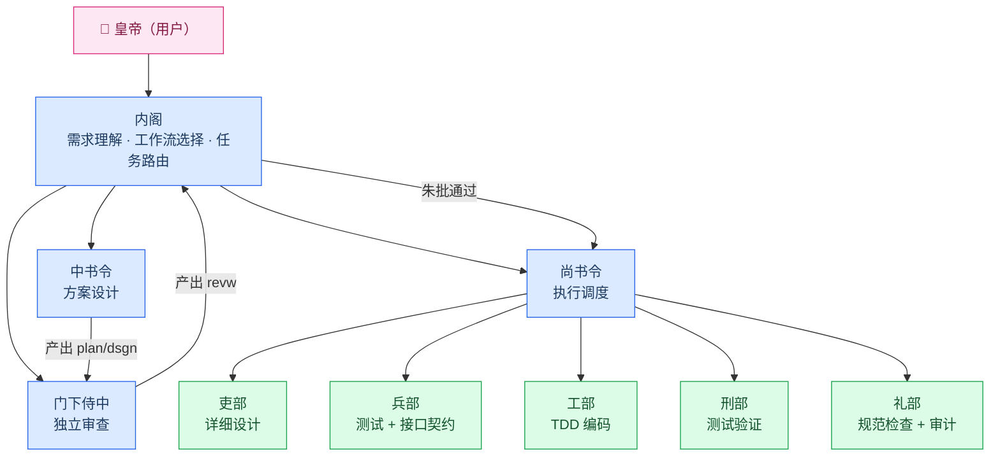
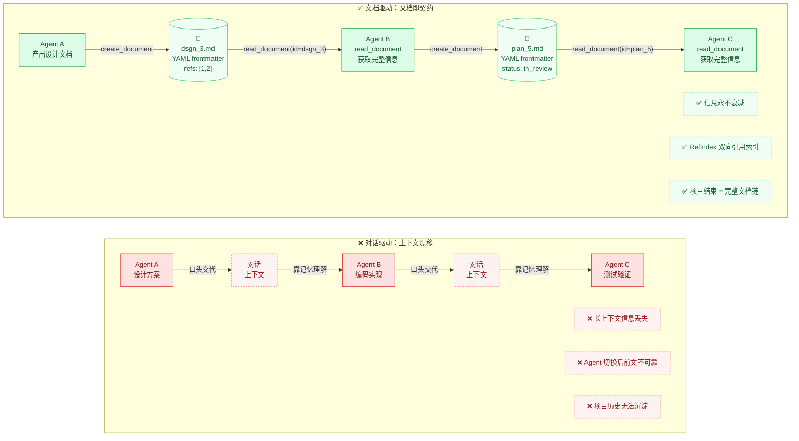
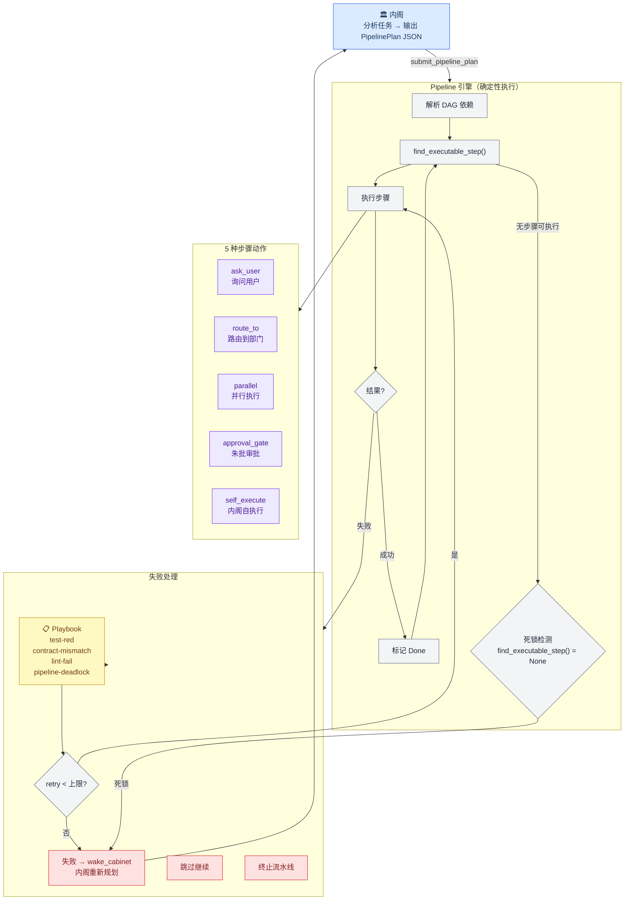

# 图片素材清单

文章需要补充的图片。Mermaid 源文件可渲染为 PNG：用 https://mermaid.live 在线导出，或 `mmdc -i input.mmd -o output.png`（需装 mermaid-cli）。

---

## 图1: 三省六部 → Agent 映射架构图

**文件名**: `architecture.mmd`
**用途**: 放在第二节开头，展示制度隐喻到代码架构的映射
**建议尺寸**: 宽 1200px

---

## 图2: 文档驱动 vs 对话驱动对比图

**文件名**: `doc-vs-chat.mmd`
**用途**: 放在第三节第2点（文档即项目记忆），直观展示两种通信模式的差异
**建议尺寸**: 宽 1200px

---

## 图3: Pipeline 引擎执行流程（建议补充）

**文件名**: `pipeline.mmd`
**用途**: 放在第三节第1点，展示内阁定计划 → 引擎执行的完整链路
**建议尺寸**: 宽 1200px

---

## 图4: 客户端截图清单

优先截以下 3 张：

| 截图 | 文件名 | 对应文章位置 | 截什么 |
|---|---|---|---|
| 主界面全貌 | `dashboard.png` | 第二节（设计思路）| 左侧聊天面板 + 中间部门状态栏 + 右侧文档树，三项同屏 |
| 朱批审批 | `approval.png` | 第二节"朱批审批"段 | 决策面板，文档状态为"待皇帝御批"时的界面，展示 `<options>` 按钮 |
| 审计/Checkpoint | `checkpoint.png` | 第三节第3点 | Checkpoint 历史列表 + 文档血缘树 |

> 截图注意事项：使用默认/浅色主题，遮挡 API Key 等敏感信息，窗口宽度 1200px 左右以保证文字清晰。
