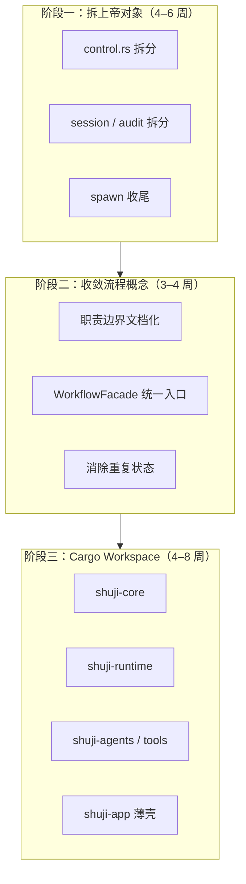
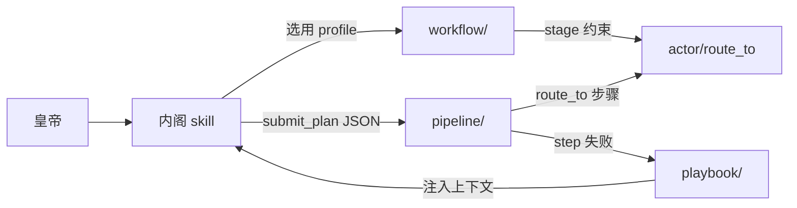
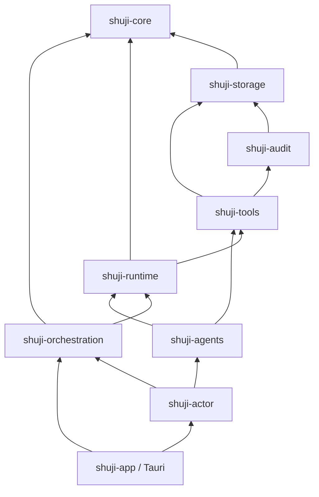

# 枢机（ShuJi）三阶段重构方案

> **状态**：执行中（渐进式，非大重写）  
> **制定日期**：2026-06-22  
> **关联文档**：[shuji-app/docs/ARCHITECTURE.md](../shuji-app/docs/ARCHITECTURE.md)（现行实现）、[shuji-app/docs/design/future-mailbox.md](../shuji-app/docs/design/future-mailbox.md)（未来设计，**本方案不实施**）

---

## 1. 背景与目标

### 1.1 问题陈述

项目早期采用「提需求 → AI 直接编码」的方式快速堆功能，导致：

- **上帝文件**：单文件承担过多职责（如 `api/control.rs` ~920 行、`audit/mod.rs` ~1058 行、`api/session/mod.rs` ~815 行），改动牵一发而动全身。
- **概念并行**：`workflow`、`pipeline`、`playbook`、内阁 `skill` 都在描述「流程」，边界未书面化，新人难以判断新功能应落在哪一层。
- **设计与实现分叉**：`future-mailbox.md`（Pull 信箱）与现行 Push 模型并存，易误按未来设计改现在代码。

### 1.2 重构原则

| 原则 | 说明 |
|------|------|
| **绞杀者模式（Strangler Fig）** | 在现有仓库内小步拆分，每步可发布、可回滚 |
| **测试守护** | 每 PR 前后跑全量测试；行为不变优先于结构漂亮 |
| **设计先行** | 大改前写 ADR（见 [§6](#6-adr-与-pr-流程)） |
| **不推翻主干架构** | 保留 Actor + mpsc、Session/Controller 分离、文档即契约 |
| **不新建全量仓库** | 不推倒重来；实验性架构另开分支或子目录 |

### 1.3 不在范围内

- 实现 `future-mailbox.md` 中的 Pull 信箱 V2
- 前端 UI 大改（除配合后端事件契约的薄改动）
- 将 LLM 替换为规则引擎
- 删除现有 ~400 项测试以「简化」代码

### 1.4 总览



**预估总工期**：11–18 周（兼职推进）；每阶段可独立验收，不必等下一阶段才开始修 bug。

---

## 2. 阶段一：拆分上帝对象

**目标**：把「改一处怕崩全局」的大文件拆成职责单一、可单测的子模块。  
**验收标准**：核心文件单文件 ≤ 400 行（`run()` 主循环除外可 ≤ 150 行）；`cargo test` 全绿；无对外 API 行为变化。

### 2.1 现状热点

| 文件 | 约行数 | 主要问题 |
|------|--------|----------|
| `api/control.rs` | ~920 | 工具循环、Watchdog、路由检测、Checkpoint/Compact 回调全在一处 |
| `audit/mod.rs` | ~1058 | 日志、RefIndex、谱系、diff、checklist、violations 耦合 |
| `api/session/mod.rs` | ~815 | step、sanitize、持久化、token 重试混在一起 |
| `agent/neige/mod.rs` | ~644 | skill 循环、pipeline 入口、soul 更新与执行交织 |
| `tool/dispatch.rs` | ~471 | 工具分发 + 门禁 + 缓存失效可再拆 |
| `actor/spawn/` | 进行中 | `spawn.rs` 已拆为子模块，需收尾并补文档 |

`actor/spawn/` 拆分已是正确方向，阶段一应完成其余文件的同等级拆分。

### 2.2 `api/control.rs` 拆分方案

**目标结构**：

```
api/control/
├── mod.rs              # AgentController 门面 + pub use
├── types.rs            # RunResult, RouteTo, RouteMsgType, 回调类型别名
├── iterations.rs       # max_iterations_for_tools, is_read_tool
├── run_loop.rs         # run() 主循环（编排层，≤150 行）
├── tool_batch.rs       # 单轮 tool_calls 执行（并行读、串行写）
├── watchdog.rs         # 同工具重复、只读不写、delete-create 循环检测与干预文案
├── route_detect.rs     # 从 tool 输出 JSON 解析 route_to
├── lifecycle.rs        # interrupt, suspend, take_snapshot, checkpoint 触发
└── step_emit.rs        # setup_agent_step_emitter, DeptStep 发射
```

**迁移顺序**（每步一个 PR）：

1. **PR-1.1** 抽出 `types.rs` + `iterations.rs`（零行为变化，纯移动）
2. **PR-1.2** 抽出 `watchdog.rs`（已有 `watchdog_behavior_test.rs`，跑通即验收）
3. **PR-1.3** 抽出 `route_detect.rs`（依赖 `session_control_test` / `actor_test`）
4. **PR-1.4** 抽出 `tool_batch.rs` + `step_emit.rs`
5. **PR-1.5** 抽出 `lifecycle.rs`；`run_loop.rs` 只保留编排

**阶段一验收命令**：

```bash
cd shuji-app/src-tauri
cargo test --test watchdog_behavior_test
cargo test --test session_control_test
cargo test --test actor_test
cargo clippy --all-targets
```

### 2.3 `api/session/mod.rs` 拆分方案

```
api/session/
├── mod.rs              # Session 门面
├── step.rs             # step()、finish_reason=length 重试
├── sanitize.rs         # 孤儿 tool 消息、截断 tool_call 清理
├── persist.rs          # PersistedContext save/load/trim
└── snapshot.rs         # snapshot()、消息克隆
```

迁移顺序：`sanitize` → `persist` → `step`（`step` 依赖前两者，放最后）。

### 2.4 `audit/mod.rs` 拆分方案

```
audit/
├── mod.rs              # 对外 re-export
├── log.rs              # append audit.jsonl
├── ref_index.rs        # RefIndex、check_immutability
├── lineage.rs          # LineageNode、build_lineage、trace_document
├── diff.rs             # save_diff、patch 存储
├── checklist.rs        # checklist.json CRUD
├── violations.rs       # violations.jsonl
└── timeline.rs         # build_timeline、report
```

每拆出一个子模块，在 `audit_test.rs` 中确认对应用例仍通过。

### 2.5 `actor/spawn` 收尾

当前结构（`mailbox` → `exec_loop` → `neige` / `output` / `fallback`）已合理。收尾项：

- [ ] 在 `shuji-app/docs/ARCHITECTURE.md` 补充 `spawn/` 模块图（与 `actor/mod.rs` 对齐）
- [ ] 删除已废弃的 `spawn.rs` 单文件引用（若仍存在）
- [ ] `actor_test.rs` 覆盖 Interrupt / Replace / Task 三条路径

### 2.6 阶段一里程碑

| 里程碑 | 完成标志 |
|--------|----------|
| M1.1 | `control/` 目录落地，原 `control.rs` 删除 |
| M1.2 | `session/`、`audit/` 子模块落地 |
| M1.3 | 全量 `cargo test --tests -- --skip expand_requirements --test-threads=1` 通过 |
| M1.4 | `ARCHITECTURE.md` 更新模块表 |

---

## 3. 阶段二：收敛流程概念

**目标**：明确 `workflow`、`pipeline`、`playbook`、内阁 `skill` 的职责边界，提供单一编排入口，避免四套机制各写各的状态。  
**验收标准**：新功能负责人在 5 分钟内能回答「该改哪个模块」；`.shuji/` 下流程相关状态文件有唯一写入方。

### 3.1 职责矩阵（目标态）

| 模块 | 负责 | 不负责 | 持久化 |
|------|------|--------|--------|
| **内阁 skill**（`agent/neige/skills/`） | LLM 侧工作流*策略*：选路、对话、`<skill>` 切换 | 不机械执行步骤、不保证顺序 | 无（prompt 层） |
| **workflow/** | 任务*画像*：Profile YAML、`WorkflowState`、`StageTracker`、`WorkflowGraph` | 不直接调 LLM、不执行 shell | `.shuji/workflow_state.json`、文移图 |
| **pipeline/** | *机械*执行 JSON Plan：`PipelineEngine`、依赖图、死锁检测、approval_gate | 不替代内阁意图推断 | `.shuji/pipeline/runtime.json` |
| **playbook/** | 失败场景*知识注入*：按 event 返回 Markdown 指引 | 不路由、不改状态 | 无（静态资源） |

**协作关系**：



### 3.2 问题清单（阶段二要解决）

1. **Profile 与 Pipeline 双轨**：内阁既可走 skill 启发式路由，又可 `submit_plan` 走 Pipeline，两者可能写出冲突的 `WorkflowState` / `runtime.json`。
2. **StageTracker 与 Pipeline steps 重叠**：`workflow/stage.rs` 的默认阶段与 `pipeline/templates.rs` 描述类似流程。
3. **Playbook 触发点分散**：watchdog、pipeline `on_failure`、validate 失败多处可能注入 playbook，缺统一 registry。

### 3.3 实施方案

#### 3.3.1 新增 `orchestration/` 门面（或 `workflow/facade.rs`）

```rust
// 概念 API（实现时按现有类型调整）
pub enum ExecutionMode {
    SkillDriven,      // 内阁 skill + route_to（默认、demo、simple）
    PipelineDriven,   // submit_plan 后由 PipelineEngine 接管
}

pub struct WorkflowFacade {
    mode: ExecutionMode,
    state: WorkflowState,
    pipeline: Option<PlanRuntime>,
}

impl WorkflowFacade {
    pub fn start(profile_id: &str, governance: &str) -> Self { ... }
    pub fn on_plan_submitted(plan: PipelinePlan) -> PipelineResult { ... }
    pub fn on_route_completed(target: Role) -> StageAdvanceResult { ... }
    pub fn on_failure(event: &str) -> Option<String> { ... }  // 委托 playbook
}
```

**规则**：

- `send_message` 启动时**只通过** `WorkflowFacade::start` 写 `WorkflowState`。
- 进入 `PipelineDriven` 后，内阁 skill 路由**暂停**，直到 pipeline 完成或 `wake_cabinet`。
- `playbook_for_event` 只从 `WorkflowFacade::on_failure` 调用，不散落各处。

#### 3.3.2 状态文件所有权

| 文件 | 唯一写入方 |
|------|------------|
| `.shuji/workflow_state.json` | `WorkflowFacade` |
| `.shuji/pipeline/runtime.json` | `PipelineEngine`（经 Facade 生命周期管理） |
| `.shuji/workflow_graph.json`（若存在） | `WorkflowGraph`（route_to 钩子） |

#### 3.3.3 文档与测试

- 更新 `ARCHITECTURE.md` § Workflow，加入上表与模式切换图。
- 新增 `orchestration_test.rs`（或扩展 `workflow_mock_test.rs`）：
  - skill 模式不创建 `pipeline/runtime.json`
  - pipeline 模式完成后 `WorkflowState.current_stage == "done"`
  - 同一 session 不允许无清理地切换模式

### 3.4 迁移顺序

| PR | 内容 |
|----|------|
| PR-2.1 | 职责矩阵写入 `ARCHITECTURE.md` + ADR-001 |
| PR-2.2 | 实现 `WorkflowFacade` 骨架，`send.rs` 改调用 Facade |
| PR-2.3 | Pipeline 启动/结束走 Facade；禁止双写 state |
| PR-2.4 | Playbook 触发点收敛到 Facade |
| PR-2.5 | 集成测试 + 删除废弃的直接 state 写入 |

### 3.5 阶段二里程碑

| 里程碑 | 完成标志 |
|--------|----------|
| M2.1 | ADR-001「流程编排单一入口」合并 |
| M2.2 | `workflow_mock_test` + `pipeline_test` 覆盖模式切换 |
| M2.3 | 无模块在 `send.rs` 外直接 `WorkflowState::save` |

---

## 4. 阶段三：Cargo Workspace 拆分

**目标**：用 crate 边界强制依赖方向，练习「公开 API 设计」；Tauri 应用层只做 IO 适配。  
**前置条件**：阶段一、二完成（否则会把混乱复制到多个 crate）。

### 4.1 目标 Workspace 结构

```
ShuJi/
├── Cargo.toml                    # workspace root
├── crates/
│   ├── shuji-core/               # 纯数据与配置，无 async I/O
│   │   └── models, config, role, message, project
│   ├── shuji-storage/            # .shuji/ 目录、checkpoint、文档路径
│   ├── shuji-audit/              # 审计子系统（自阶段一 audit/ 模块提升）
│   ├── shuji-tools/              # tool registry + dispatch + file/doc ops
│   ├── shuji-runtime/            # session, control, compact, client
│   ├── shuji-orchestration/      # workflow + pipeline + playbook + facade
│   ├── shuji-agents/             # Agent trait + 9 部门 + runner
│   └── shuji-actor/              # actor system + spawn
└── shuji-app/
    └── src-tauri/                # 薄壳：Tauri commands、AppState、事件发射
```

### 4.2 依赖方向（禁止环）



**硬规则**：

- `shuji-core` 不依赖任何 sibling crate。
- `shuji-agents` 不依赖 `shuji-actor`（依赖倒置：actor 调 agent，而非反向）。
- 跨 crate 通信用 `trait` + 在 `shuji-app` 组装，避免 `pub use` 整包泄漏。

### 4.3 迁移顺序（每 crate 一个 PR 系列）

| 顺序 | Crate | 从哪搬 | 验收 |
|------|-------|--------|------|
| 1 | `shuji-core` | `models/`, `config/` | `cargo test -p shuji-core` |
| 2 | `shuji-storage` | `storage/` | checkpoint_test 仍通过 |
| 3 | `shuji-audit` | `audit/` | audit_test |
| 4 | `shuji-tools` | `tool/` | tool_test, path_security_test, document_test |
| 5 | `shuji-runtime` | `api/` | session_test, session_control_test |
| 6 | `shuji-orchestration` | `workflow/`, `pipeline/`, `playbook/`, facade | pipeline_test, workflow_mock_test |
| 7 | `shuji-agents` | `agent/` | workflow_demo_test（mock） |
| 8 | `shuji-actor` | `actor/` | actor_test |
| 9 | `shuji-app` | 瘦化 `lib.rs`、`commands/` | 全量集成测试 |

### 4.4 Workspace 根 `Cargo.toml` 草案

```toml
[workspace]
resolver = "2"
members = [
    "crates/shuji-core",
    "crates/shuji-storage",
    "crates/shuji-audit",
    "crates/shuji-tools",
    "crates/shuji-runtime",
    "crates/shuji-orchestration",
    "crates/shuji-agents",
    "crates/shuji-actor",
    "shuji-app/src-tauri",
]
```

### 4.5 阶段三里程碑

| 里程碑 | 完成标志 |
|--------|----------|
| M3.1 | Workspace 编译通过，`src-tauri` 仅保留 commands + 组装 |
| M3.2 | `cargo clippy --workspace --all-targets` 无 warning |
| M3.3 | CI `check.yml` 改为 `cargo test --workspace` |
| M3.4 | 各 crate 有简短 `README.md` 说明公开 API |

---

## 5. 跨阶段：仓库管理与协作

### 5.1 分支策略

```
main          ← 可发布
├── refactor/phase-1-control-split
├── refactor/phase-2-orchestration-facade
└── refactor/phase-3-workspace-shuji-core
```

- 每 PR 聚焦单一子目标，≤ 500 行净增删为宜。
- 合并前：`cargo fmt --check && cargo clippy --all-targets && cargo test --lib && cargo test --tests -- --skip expand_requirements --test-threads=1`

### 5.2 与现有计划的关系

| 文档 | 关系 |
|------|------|
| `docs/engineering-capacity/00-MASTER-PLAN.md` | 工程能力强化（验证、pipeline 测试）与本方案**互补**；阶段二 Facade 可承接 PART-02 |
| `shuji-app/docs/BACKEND_LEARNING_PLAN.md` | 研读顺序可对齐阶段一模块 |
| `future-mailbox.md` | **冻结**至三阶段完成后再评估 ADR |

### 5.3 从「需求编程」到「设计编程」

每个新功能/PR 必填（可贴在 PR 描述）：

1. **问题**：解决什么，不解决什么  
2. **边界**：属于哪一层（core / runtime / actor / agent / command）  
3. **接口**：新增或修改的 public 类型/trait  
4. **测试**：哪个测试文件锁定行为  

AI 辅助编码应在 ADR/接口评审**之后**进行。

---

## 6. ADR 与 PR 流程

### 6.1 ADR 目录

```
docs/adr/
├── README.md
├── 0001-orchestration-single-entry.md    # 阶段二
├── 0002-control-module-split.md          # 阶段一
└── 0003-workspace-crate-boundaries.md    # 阶段三
```

### 6.2 ADR 模板

```markdown
# ADR-NNN: 标题

## 状态
提议 | 已接受 | 已废弃

## 背景
（问题与约束）

## 决策
（选了什么）

## 后果
（正面 + 负面 + 迁移成本）

## 不做什么
（明确排除项）
```

阶段一第一个 PR 创建 `docs/adr/0002-control-module-split.md`；阶段二创建 `0001`；阶段三创建 `0003`。

---

## 7. 风险与回滚

| 风险 | 缓解 |
|------|------|
| 拆分 PR 过大难以 review | 单 PR 只做「移动代码」，不改逻辑 |
| Workspace 拆环依赖 | 先画依赖图再搬；发现环则引入 trait 打断 |
| 行为回归 | 优先扩展现有集成测试，而非只加单元测试 |
| 半途而废 | 每阶段有独立里程碑，可先发布阶段一成果 |

回滚策略：每 PR 保持可 revert；阶段三每个 crate 合并后打 tag（`workspace-shuji-core-v0.1` 等）。

---

## 8. 执行检查清单

### 阶段一

- [ ] `api/control/` 拆分完成
- [ ] `api/session/` 拆分完成
- [ ] `audit/` 子模块拆分完成
- [ ] `actor/spawn` 文档与测试收尾
- [ ] `ARCHITECTURE.md` 模块表更新

### 阶段二

- [ ] 职责矩阵合并进 `ARCHITECTURE.md`
- [ ] `WorkflowFacade` 实现
- [ ] Playbook 触发点收敛
- [ ] `orchestration` 集成测试

### 阶段三

- [ ] Workspace 根 `Cargo.toml`
- [ ] 8 个 library crate + app 瘦壳
- [ ] CI 更新
- [ ] 各 crate README

---

## 9. 参考

- [绞杀者模式 - Martin Fowler](https://martinfowler.com/bliki/StranglerFigApplication.html)
- [架构决策记录 (ADR)](https://cognitect.com/blog/2011/11/15/documenting-architecture-decisions)
- 项目内：[ARCHITECTURE.md](../shuji-app/docs/ARCHITECTURE.md)、[TEST_FLOW.md](../shuji-app/docs/TEST_FLOW.md)
