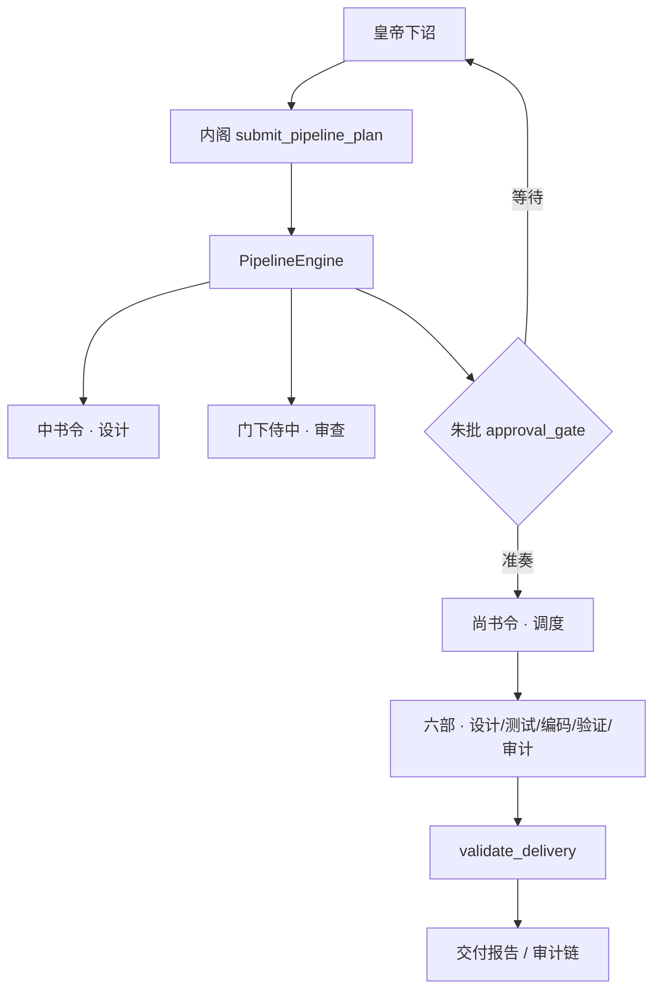

# 枢机架构说明

> 对外叙事 + Agent 必读。本文描述枢机（ShuJi）的现行架构与关键机制。
> 文件级索引见 `AGENTS.md`；开发指南见 [CONTRIBUTING.md](../../CONTRIBUTING.md)。
>
> **核对日期**：2026-06-30（基于 `shuji-app/src-tauri/src/` 实际目录结构与 v0.8.0+ 代码）。

---

## 主路径（Pipeline-first）

```
皇帝需求
  → send_message → 内阁 submit_pipeline_plan
  → PipelineEngine 按步骤调度各部门
       ├─ 中书令 → 方案设计
       ├─ 门下侍中 → 审查
       ├─ approval_gate → 朱批
       ├─ 尚书令 → 执行调度
       │   ├─ 吏部 → 详细设计
       │   ├─ 兵部 → 测试与接口契约
       │   ├─ 工部 → TDD 编码（分批计划）
       │   ├─ 刑部 → 运行测试验证
       │   └─ 礼部 → 规范检查与审计
       └─ validate_delivery → 交付验证
```

内阁分析任务后提交结构化 **PipelinePlan**；引擎按依赖顺序驱动部门，关键文档需朱批后才能继续。

Legacy `route_to` 仅在 Pipeline 保存的旧 runtime.json 中存在（加载时自动迁移为 `dispatch_to`）；agent 层面的 `route_to` 工具已在 M2 移除。



---

## 9 Actors + 2 Sub-agents

每个 actor 是一个 `tokio::spawn` 配 `mpsc::UnboundedReceiver` 邮箱。部门间以**文档**为中心通信：PipelineEngine 通过 `dispatch_to` 步骤传递文档 ID，接收方读取文档理解任务。

### 决策层

- **内阁 (Neige)** — 编排者。向 PipelineEngine 提交 `submit_pipeline_plan`。具备 soul 系统、运行时技能创建、暂停/恢复与必须批准门禁（3 次重试 → 自动放行）。
- **皇帝 (用户)** — 输入需求，做最终决策（朱批）。

### 设计层

- **中书令 (Zhongshuling)** — 设计者。自管理 7 个技能用于设计/分析/诊断。技能含 `## 输出块` 结构化输出模板。
- **门下侍中 (Menxiashizhong)** — 审查者。2 个技能：`review_overall`、`review_phase`。技能含结构化输出模板。

### 执行层

- **尚书令 (Shangshuling)** — 执行调度。接收 PipelineEngine 指令，路由到具体六部。
- **吏部尚书 (Libushangshu)** — 详细设计。仅用文档工具。
- **兵部尚书 (Bingbushangshu)** — 测试 + 接口契约。用文件写入 + 文档工具。
- **工部尚书 (Gongbushangshu)** — TDD 编码，**批次计划循环**：把大任务拆成计划批次，每次重入执行一批，计划与执行阶段切换 reasoning 开关。有 `force_stop` 用于批次间干净过渡。
- **刑部尚书 (Xingbushangshu)** — 测试验证。运行测试、提 bug。
- **礼部尚书 (Liburshangshu)** — 规范检查 + 审计。用审计清单工具。

### 子 Agent（同步）

- **expand_requirements** — 同步子 agent，把模糊需求展开为结构化规格。
- **survey_codebase** — 同步子 agent，扫描代码库产出分析文档。

---

## Shared Agent Runner

8 个非内阁 agent 通过 `agent/runner.rs` 共用执行框架：

- `build_compact_handler()` — 创建 CompactFn 回调（40 消息间隔）
- `build_checkpoint_handler()` — 创建 CheckpointFn 回调
- `load_and_compact_context()` — 从磁盘加载持久化上下文、压缩、恢复会话
- `save_context()` — 把会话快照到磁盘供下次执行

内阁有自己的内联版本（不使用 runner）。工部部分使用 runner（compact + checkpoint handler），但有自定义的批次计划上下文加载。

### Agent Trait (`agent/trait.rs`)

```rust
pub trait Agent {
    fn role(&self) -> Role;
    async fn execute(&self, input: &AgentInput) -> Result<AgentOutput>;
    fn after_execute(&self, output: &AgentOutput) -> LoopDecision { Done }
    fn set_interrupt_flag(&mut self, flag: Arc<AtomicBool>) {}
    fn reset_plan(&self) {}
    fn plan_display(&self) -> String { "null" }
}
```

`AgentInput` 携带：role、task_description、context_messages、项目/工作目录、configs、discuss_mode 标志、fast_cancel 标志。`AgentOutput` 携带：content、可选 route、技能名、暂停状态。

---

## Tool Registry Pattern

所有 agent 通过 `tool::registry` 的组函数组合工具列表——返回 `Vec<ToolDefinition>` 的工厂函数：

| 组 | 工具 | 使用者 |
|---|---|---|
| `doc_inspect_tools()` | read_document, list_dir, search_text | 内阁、设计者 |
| `code_inspect_tools()` | read_file, list_dir_tree, search_text | 代码 agent |
| `file_write_tools_for_code()` | create, edit, apply_patch, delete, rename | 代码 agent（无 modify/append） |
| `file_write_tools()` | 全集 + modify_file, append_file | 非代码 agent |
| `document_tools()` | create/modify/append/set_status 文档 | 所有文档工作者 |
| `audit_checklist_tools()` | init/update checklist, add_violation | 礼部 |
| `execute_command_tool()` / `run_tests_tool()` | Shell 命令 | 通用 / 工部 |
| `reauth_tool()` | request_reauth | 尚书令 |

工具返回结构化 `ToolOutput { ok, operation, path, message, error_code }`。通过 `dispatch.rs` 的 `execute_named_tool()` 调度，含门禁逻辑（append_document 在继续前检查审批状态）、缓存失效与结果大小截断。

---

## Skill System（内阁 12 技能）

内阁用 `<skill>name</skill>` 切换工作流。技能是 `.md` 文件，作为 `[skill: name]` 系统消息注入：

| 技能 | 用途 |
|---|---|
| `workflow_demo` | 单文件、零依赖 → 直接路由工部 |
| `workflow_simple` | 小范围（1-3 文件）→ 路由尚书令 |
| `workflow_standard` | 新业务逻辑 → 设计 → 审查 → 朱批 → 执行 |
| `workflow_complex` | 多阶段、多模块 → 完整 pipeline |
| `workflow_bugfix` | Bug 报告与测试失败 |
| `workflow_refactor` | 结构性变更（重命名、重组） |
| `workflow_optimize` | 性能调优、既有代码修改 |
| `workflow_audit` | 安全、合规、规范检查 |
| `clarify` | 向皇帝提问以理解需求 |
| `discuss` | 自由聊天模式，无工具、不改项目状态 |
| `reflect` | 执行后复盘，提取 经验/教训 到 soul |
| `summary` | 汇总已完成工作，产出完成报告 |

路由启发式（`routing.rs`）：纯函数文本分析器。优先级：显式技能名 > 关键词匹配（bugfix/refactor/optimize/audit/demo/complex/simple）> 回退到 `workflow_standard`。

中书令有 7 个自管理技能（设计/分析/诊断）。门下侍中有 2 个（review_overall、review_phase）。其余部门无技能系统。

---

## Prompt 架构（4 层）

```
1. base_prompt (prompt.md)         — 角色定义、部门表、工具参考
2. soul_prompt (optional)          — [soul: role] 累积经验
3. context_messages                — 技能消息、[对话摘要] 摘要、近期对话
4. user_message                    — 当前输入
```

技能与摘要作为普通 system/user/assistant/tool 消息存于 `context_messages`（非独立层）——最大化 LLM 前缀缓存命中率。

**可选输出块**：中书令/门下侍中技能文件以 `## 输出块` 模板结尾，用于结构化摘要（设计结论、待决问题、引用、路由）。其余部门的输出块嵌在 base prompt 中。这些块在 [对话摘要] 压缩后保留，使上一轮的结构化块保留关键数据。

---

## Session / AgentController 分离

- **Session**（`api/session/mod.rs`）：纯 LLM 层。拥有消息历史。`step()` = 一次 API 往返。`finish_reason=length` 时自动重试（减半 max_tokens）。处理：工具调用截断、ID 校验、孤立 tool 消息清理（两遍 sanitize）。`PersistedContext` 支持 3 层保存/加载（base、soul、context）。`trim_tool_results()` 在保存时截断冗长的工具输出。
- **AgentController**（`api/control/mod.rs`）：驱动循环。调用 `step()`、执行工具、反馈结果、处理 cancel/interrupt/restart。支持 `CompactFn`（持久化压缩上下文）与 `CheckpointFn`（git commit + 快照）。Watchdog：同工具重复、只读不写模式、连续错误追踪（5 → 自动停止）。Watchdog 向工具结果注入干预提示引导 LLM 自纠。

---

## Context Compaction

单层压缩（`api/compact/mod.rs`）含两套提示词变体：

- 内阁上下文（`compact/prompt.md`）— 汇总多轮工具使用上下文
- 部门上下文（`compact/dept_prompt.md`）— 汇总设计/编码/测试上下文

当 `context_messages` token 数超阈值 → 较旧的非技能消息送 LLM 摘要为 `[对话摘要]` 条目。技能消息从可压缩批次中剥离后重新追加到保留区。近期消息（默认 24 条）保留。每个 `[对话摘要]` 后跟 JSON 状态记录用于工作流重建。

**Mid-run 压缩**：9 个部门均在 20 轮迭代间隔注册 CompactFn。压缩 + 保存到 `.shuji/context/{role}.json`。运行中的 session 不受影响。

**三层阈值**（优先级）：`context_config.json` 每角色 > 部门内置建议（`default_compact_thresholds_for_role()`）> `config.toml` 全局默认。

---

## Batch Plan Loop（工部尚书）

工部把大任务拆成批次（`PlanState { batches: Vec<PlanBatch>, current, complete }`）：

1. LLM 调用 `submit_plan(batches)` → 设置 `force_stop` 标志 → AgentController 退出
2. `after_execute()` 返回 `Continue` → actor 带下一批作为 user 消息重入 `execute()`
3. LLM 执行批次，调用 `complete_task` → 设置 `force_stop` → 循环重复
4. 所有批次完成 → 创建报告文档，路由回尚书令

计划阶段启用 reasoning，批次执行阶段禁用（思考 vs. 执行分离）。

---

## Soul System（角色学习记忆）

9 个长生命周期 actor 从 `.shuji/soul/{Role}.md`（如 `Neige.md`）读取项目 soul。启用全局学习时，可选全局 soul 位于 `~/.shuji/soul/{Role}.md`（配置在 `~/.shuji/learning_config.json`）。

- **注入顺序**：`base prompt → [soul: Role] → context_messages`
- **`update_soul` 工具**（内阁）：向项目 soul 写结构化条目 + `index.jsonl`；可在 `~/.shuji/soul/pending_global.jsonl` 排队 `global_candidate` 条目供 UI 审批
- **限制**：500 字符/条目，4000 字符注入，8KB 文件触发 LLM 压缩
- **Restore 修复**：加载时刷新 `PersistedContext`，避免过期 `soul_prompt` 覆盖磁盘更新
- **自动提取**：pipeline 完成 + 皇帝批准备注时（保守、需证据支撑）

---

## Checkpoint System

`.shuji/.git/` 维护**独立于项目 `.git/`** 的隔离仓库：

- 用本地 git user 初始化（无需全局配置）
- `.gitignore` 把 `.shuji/` 从项目 git 排除
- 触发时：`git add -A` + commit（无变更则跳过）→ 会话快照到 `.shuji/checkpoints/{role}/{hash}.json`
- 索引在 `.shuji/checkpoints/index.json`，上限 500 条
- 恢复：`git stash` 工作区变更 → `git checkout --detach <hash>` → 恢复会话上下文
- 自动 checkpoint 每 300s（可配置），外加每次执行后最终 checkpoint

---

## Audit System

事件驱动审计，多子系统（`audit/mod.rs` + `audit/document_line.rs`）：

- **审计日志**：追加式 `.shuji/audit.jsonl`（JSONL、ISO-8601 时间戳、event/role/doc_id/detail）。每个文档工具操作都写入。
- **RefIndex**：`.shuji/audit/ref_index.json` — `HashMap<String, RefIndexEntry>` 含正向 refs 与反向 `ref_by` 索引。O(1) 查"哪些文档引用了我？"与"我引用了哪些？"。`check_immutability()` 检测修改已批准文档是否影响下游。
- **文档血缘**：`LineageNode` 递归树。`build_lineage()` 遍历 `refs` 构建依赖树。`trace_document()` 返回 `TraceResult`（target、downstream、upstream）含阶段分类（reqs/design/plan/contract）。
- **Diff 追踪**：`save_diff()` 在每次 modify/append 时用 `diffy` crate 计算 unified diff，存于 `.shuji/audit/diffs/{doc_id}_{event}_{ts}.patch`。
- **Checklist**：`.shuji/audit/checklist.json` — 结构化审计清单含 pass/fail/na 项。
- **Violations**：`.shuji/audit/violations.jsonl` — 严重度（error/warning/info）、规则 ID、状态（open/fixed/waived）。
- **Re-auth**：`.shuji/audit/reauth_request.json` — 礼部请求重新认证，由 dispatch gate 消费。
- **交付报告**：`.shuji/audit/report.md` — 时间范围内聚合的 markdown 报告。
- **Timeline**：`build_timeline()` — 按类型与角色聚合事件，按频率排序。

---

## Document-Centric Architecture

部门间通过 `.shuji/` 下的文档通信。YAML frontmatter 格式，自动分配 ID。

**文档类型**：dsgn、plan、pdsg、ddtl、revw、task、ctrt、rprt、anls、reqs、precepts。

**朱批（审批系统）**：plan/revw 文档需皇帝批准后下游才能继续。PipelineEngine 的 `dispatch_to` 步骤与 `append_document` 对未批准文档硬性门禁。`set_document_status` 工具（approved/rejected）需要 `emperor_note`。

---

## Cancel Mechanism

两层：

1. **AtomicBool**（`AppState.cancel_flag`）：用户全工作流取消。在每个 `AgentController.run()` 迭代顶部检查。
2. **FastMessage**（`actor/mod.rs`）：内阁可通过 `cancel_agent` 工具精确中断指定部门。每个 actor 用独立的 `mpsc::UnboundedSender`。

---

## Discuss Mode

`discuss` 技能 → 独立的 `discuss_with_cabinet` Tauri 命令。不改项目状态、无工具。直接返回 `ChatMessage`（不经 actor 系统）。

---

## Config Priority Chain

```
运行时行为: config.local.toml  >  config.toml  >  编译期默认
API 凭证:    api_config.json    >  .env         >  硬编码回退
压缩阈值:    context_config.json (每角色) > 部门内置 > 全局默认
```

- `config.toml`：版本控制、团队共享运行时配置（超时、max_tokens、迭代上限、压缩阈值、watchdog、reasoning）
- `config.local.toml`（gitignored）：选择性字段覆盖——仅非默认值生效
- `api_config.json`（gitignored）：UI 管理的每角色 API key/url/model。支持预设（balanced/economy/quality）含模型映射
- `context_config.json`：每角色压缩阈值覆盖（UI 或手动编辑）

---

## Session Limits（config.toml 可配置）

| 设置 | 默认 | Agent |
|---|---|---|
| write_file max_tokens | 0（无限） | 兵部、工部 |
| append_document max_tokens | 4096 | 中书令、吏部、刑部 |
| 只读 max_tokens | 2048 | 礼部 |
| 写密集工具迭代 | 60 | 兵部、工部 |
| 文档密集工具迭代 | 100 | 中书令、吏部、刑部 |
| 只读工具迭代 | 80 | 礼部 |
| finish_reason=length 重试 | 5（每次减半） | 全部 |
| 连续工具错误 | 5 → 自动停止 | 全部 |
| 最大计划循环迭代 | 6 | 工部 |
| Checkpoint 间隔 | 300s | 全部 |

---

## Edge Cases Handled

- **截断的工具调用**：过滤 assistant 消息仅留有效 `tool_call_id`（防 400 错误）
- **所有工具调用损坏**：返回 `StepResult::Text` 而非空 `ToolCalls`（防死循环）
- **孤立 tool 消息**：两遍 sanitize——先收集所有 ID，再过滤（消除顺序相关竞争）
- **Soul 消息漂移**：`PersistedContext` 单独存储 `soul_prompt`，保存/加载时保留其在 base 与 skill prompt 间的位置
- **Windows CRLF**：`log_console!` 用 `write!` + 显式 `\n` 而非 `eprintln!`
- **技能循环去重**：内阁连续输出同一 `<skill>` 标签两次则中断循环
- **自路由预防**：PipelineEngine 禁止 `dispatch_to` 目标为自己所在的部门（defense-in-depth）
- **必须批准重提示守卫**：连续 3 次无 `<options>` → 自动放行继续
- **压缩并发安全**：AppState 中活跃角色追踪 + `compacting_roles` 防双击；原子 tmp+rename 写入
- **路径安全**（`resolve_scoped_path`）：拒绝绝对路径与 `..` 穿越。回退到祖先遍历 + canonicalize。捕获符号链接逃逸攻击。
- **命令安全**（`check_safe_command`）：token 匹配。阻断 `sudo rm`、`format X:`、`shutdown`、`mkfs`、`dd`、`wget`/`curl` 到外部 URL。

---

## Token Tracking

两套并行系统：

- **`token_tracker.rs`**：持久化 JSON，每次调用记录（prompt/cached/uncached/completion），按时间窗口聚合（今日/近3天/近7天/汇总）。通过 `get_token_stats` 命令暴露。
- **`round_metrics.rs`**：内存实时，追踪当前角色、技能、累计 token 含缓存拆分、部门迭代。通过 `get_round_metrics` 命令暴露。

缓存字段从 API 响应解析：OpenAI `usage.prompt_tokens_details.cached_tokens` 或 Anthropic `usage.cache_read_input_tokens`。

---

## Project State Persistence

- `Project.talk`：追加式，自动修剪到 ~12 条（最旧 → 摘要）
- `Project.task`：里程碑（追加式，不修剪）
- `Project.summary`：单行状态，自动更新
- 每个里程碑事件持久化到 `.shuji/state.json`

---

## API Dual-Format

单一 `AnthropicClient` 结构体按请求自动检测格式：

- URL 含 `anthropic.com` → Anthropic Messages API（`x-api-key` header）
- 否则 → OpenAI Chat Completions API（`Bearer` auth）
- 非 Anthropic API 自动启用 reasoning/thinking tokens

---

## 关键文件位置

```
shuji-app/
├── src/                              # 前端 (React + Vite + Tailwind CSS 4 + Vitest)
│   ├── pages/                        # WorkspaceSelect, ProjectDashboard, LogsPage, SetupPage
│   ├── components/
│   │   ├── ui/                       # 原始 UI kit (Button, Card, Tabs, 等)
│   │   ├── ChatBubble.tsx            # <options> 可点按钮
│   │   ├── ChatInput.tsx / ChatPanel.tsx
│   │   ├── DeptStatusPanel.tsx / DeptStatusBar.tsx  # 实时部门状态
│   │   ├── DocPreview.tsx / DocTree.tsx / DocumentViewer.tsx  # 文档浏览器
│   │   ├── DecisionPanel.tsx / AuditPanel.tsx  # 决策/审计 tabs
│   │   ├── CheckpointPanel.tsx       # Checkpoint 快照列表/恢复
│   │   ├── TokenPanel.tsx / ContextPanel.tsx  # 侧栏面板
│   │   ├── ProjectOverview.tsx / WorkflowTimeline.tsx
│   │   ├── HelpDrawer.tsx / DemoTour.tsx
│   │   ├── SettingsMenu.tsx / SealLogo.tsx / LogBar.tsx
│   │   ├── ReasoningSettingsTab.tsx  # LLM reasoning/thinking 配置 UI
│   │   └── ProjectPicker.tsx
│   ├── hooks/                        # React hooks (Tauri 事件, useChat 等)
│   ├── utils/                        # chat.ts, error.ts
│   ├── api.ts                        # Tauri invoke 封装
│   ├── types.ts                      # TypeScript 类型定义 (RoleName union 等)
│   ├── constants.ts
│   └── test/setup.ts                 # Vitest setup (jsdom, testing-library)
└── src-tauri/src/
    ├── commands/                     # Tauri 命令处理器
    │   ├── project.rs                # 项目 CRUD + demo 生成器
    │   ├── workflow/                 # send_message, discuss, compact, context_stats
    │   ├── settings.rs               # .env + api_config.json 加载, 模型预设
    │   ├── checkpoint.rs             # 列出/恢复 checkpoints
    │   ├── shuji_docs.rs             # .shuji/ 文件树 + 文档查看器
    │   ├── pricing.rs                # 定价系统
    │   ├── metrics.rs                # 运行指标
    │   ├── validate.rs               # 交付验证命令
    │   └── workflow/audit.rs         # 审计 Tauri 命令 (lineage, timeline, diffs, report)
    ├── actor/mod.rs                  # Actor 系统: run_actor, ActorContext, FastMessage/FastChannel
    ├── agent/
    │   ├── trait.rs                  # Agent trait + AgentInput/Output, LoopDecision
    │   ├── runner.rs                 # 共享执行框架 (compact/checkpoint/context 辅助)
    │   ├── util.rs                   # 标签提取辅助
    │   ├── expand_requirements.rs    # 需求展开 sub-agent
    │   ├── survey_codebase.rs        # 代码库调查 sub-agent
    │   ├── neige/                    # 内阁: mod.rs, prompt.md, routing.rs, skills/ (12 .md)
    │   ├── zhongshuling/             # 中书令: mod.rs, prompt.md, skills/ (7 skills)
    │   ├── menxiashizhong/           # 门下侍中: mod.rs, prompt.md, skills/ (2 skills)
    │   ├── shangshuling/             # 尚书令: mod.rs, prompt.md
    │   ├── libushangshu/             # 吏部: mod.rs, prompt.md
    │   ├── bingbushangshu/           # 兵部: mod.rs, prompt.md
    │   ├── gongbushangshu/           # 工部: mod.rs, prompt.md (批次计划循环)
    │   ├── xingbushangshu/           # 刑部: mod.rs, prompt.md
    │   └── liburshangshu/            # 礼部: mod.rs, prompt.md
    ├── api/
    │   ├── client.rs                 # AnthropicClient (双格式 HTTP)
    │   ├── session/                  # mod.rs (Session, PersistedContext, step), persisted_context.rs
    │   ├── control/                  # mod.rs (AgentController), iterations.rs, types.rs
    │   ├── reasoning.rs              # 每厂商 reasoning/thinking token 注入
    │   ├── compact/                  # 上下文压缩 (2 提示词变体)
    │   ├── intent.rs                 # 意图拦截层
    │   ├── stream.rs                 # 流式支持
    │   └── token_count.rs            # Token 计数
    ├── tool/
    │   ├── registry.rs               # 工具组工厂函数
    │   ├── dispatch.rs               # 中央工具调度 + 门禁逻辑
    │   ├── file_ops/ / documents/    # 文件与文档操作
    │   ├── command_ops.rs / editor.rs / lint_ops.rs / python_cmd.rs
    │   ├── audit_tools.rs / neige_special.rs / shangshuling_special.rs
    │   ├── cache.rs / path.rs / output.rs / tool_log.rs / test_env.rs
    ├── pipeline/                     # engine.rs, schema.rs, artifacts.rs, handlers.rs, supervisor.rs, templates.rs
    ├── workflow/                     # graph.rs, stage.rs, state.rs, profiles/
    ├── audit/                        # mod.rs, document_line.rs
    ├── config/                       # mod.rs (RuntimeConfig), esaa_contract.rs
    ├── learning/                     # soul 学习系统
    ├── metrics/                      # 运行指标
    ├── playbook/                     # playbook 系统
    ├── precepts/                     # 规范/约束
    ├── scenario/                     # 场景重放
    ├── validate/                     # 交付验证 (delivery, lint, tests_runner)
    ├── templates/                    # 模板
    ├── storage/                      # shuji_dir.rs, checkpoint.rs
    ├── logging/logger.rs             # 部门级 JSONL 日志
    ├── round_metrics.rs / token_tracker.rs
    └── lib.rs                        # Tauri builder, 插件注册
```
